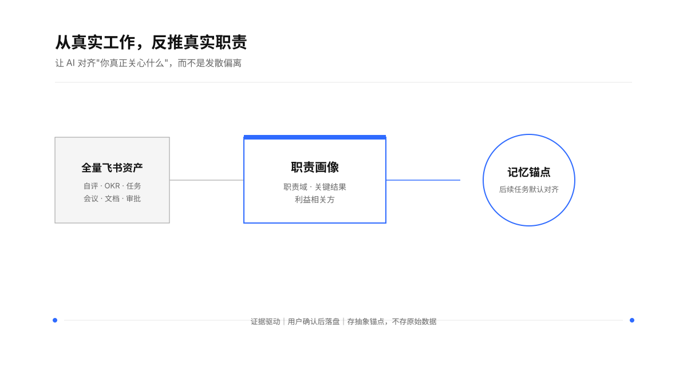
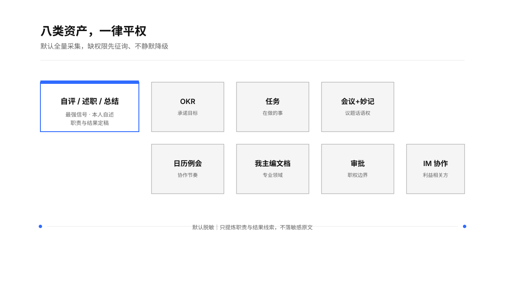
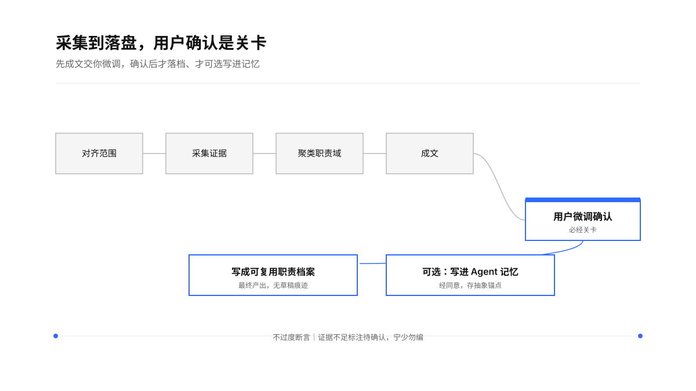

> "There is nothing so useless as doing efficiently that which should not be done at all." — Peter F. Drucker

<div align="center">

### **先让 AI 搞懂：你到底在负责什么。**

*Ground the agent in what you actually own.*


<br>
从你全量的重要飞书资产里，反推出你最近半年真实在做的工作职责，成文、可微调，写进 Agent 记忆做长期锚点
</div>

---

# 我的工作职责｜My Job Responsibilities

<p align="center">
  
  
  
  
  
</p>

很多时候，你让 AI 去探索、去查找、去判断，它给出的方向和你本人真正关心的事是**偏离**的——因为它并不知道你到底在负责什么。

**我的工作职责**是一个面向 Agent 的能力：从你全量的重要飞书资产里，反推出你最近半年真实承担的工作职责，用一套成熟的框架写出来，交你微调确认，再写进 Agent 的记忆里。之后 AI 的每一次探索和判断，都有一个稳定的锚点去对齐"你真正关心什么"。

英文标识：`my-job-responsibilities`　｜　中文名：**我的工作职责**

<p align="center">
  
</p>

## 解决什么问题

- **AI 探索偏离**：没有职责锚点时，AI 的查找与判断容易发散到你并不关心的方向。
- **职责说不清**：名义头衔不等于真实职责；你实际在做什么，散落在 OKR、任务、会议、文档里。
- **上下文反复重建**：每次都要向 AI 重述"我是做什么的"，低效且不一致。

## 从哪里取材

不做"核心 vs 次要"的取舍——**八类重要飞书资产一律平权、默认全量采集**。它们从不同角度共同印证你的真实职责。缺权限时先征询是否补授权，而不是静默丢弃。

<p align="center">
  
</p>

其中**本人写的自评 / 述职 / 晋级 / 总结类文档**是最强信号——它直接写了"我对什么结果负责、量级多大、承接了哪些硬骨头"，把散点动作锚定成职责域。（飞书绩效系统 OpenAPI 一般拿不到授权，故以本人写的这类文档替代。）

## 怎么成文

用一套成熟的框架描述每条职责，而不是堆动词：

| 维度 | 含义 |
| --- | --- |
| **职责域** | 我负责什么领域 / 主线 |
| **关键结果** | 这个域要交付什么可观察的结果 |
| **利益相关方** | 对谁负责、和谁协作 |

风格结论先行、克制、不堆"负责 / 推进 / 跟进"的空转；证据不足的职责标 `[推断待确认]`，宁少勿编。

## 工作流

七步，从对齐范围到落盘。**用户微调确认是必经关卡**——先成文交你改，确认后才写档案，才可选写进记忆。

<p align="center">
  
</p>

1. **对齐范围**：时间窗（默认近 6 个月；自评类放宽到近 12 个月）、纳入哪些资产、产出落点。
2. **采集证据**：按 playbook 逐类采集，边采边建脱敏证据台账。
3. **聚类职责域**：按业务结果聚类，不按项目名或工具堆叠；跨源印证优先。
4. **成文**：用「职责域 + 关键结果 + 利益相关方」写每条职责。
5. **交你微调**：呈现草稿 + 证据覆盖说明，等你增删、纠正、确认。
6. **写成档案**：生成可复用的职责档案文件，无草稿痕迹、无过程叙述。
7. **可选写进记忆**：经你同意，把浓缩的职责锚点写进 Agent 记忆。

## 使用

在装有本 skill 的 Agent 里，直接说：

```
根据我最近半年的飞书 OKR、任务、会议和文档，帮我总结出我的工作职责
```

Agent 会读取 `SKILL.md` 作为执行入口，按需加载 `references/` 里的采集口径、成文规则和记忆写入规范。

## 边界

- **只产职责画像，不做能力评价、不做绩效判断**——它回答"在做什么"，不回答"做得好不好"。
- **默认脱敏**：只提炼职责与结果线索，原始聊天 / 邮件 / 文档正文、薪酬、等级、他人评价不进档案和记忆。
- **身份隔离**：读飞书前核验租户与身份；个人与公司飞书不混用。
- **不过度断言**：基于可见活动窗口的推断，非全面能力评估；缺权限如实标注，不静默降级。
- 不负责撰写招聘 JD、绩效评估、写 OKR 本身。

## 结构

```
my-job-responsibilities/
├── SKILL.md                          # 执行入口：目标、数据源、七步工作流
├── references/
│   ├── collection-playbook.md        # 八类资产采集口径、命令与实测坑
│   ├── synthesis-rules.md            # 聚类与成文规则、措辞正反例
│   └── memory-write.md               # 记忆锚点格式与跨 agent 落点
├── assets/
│   └── profile-template.md           # 职责档案文件模板
├── agents/openai.yaml                # UI 元数据
└── LICENSE
```

## 许可证

[MIT](LICENSE)
